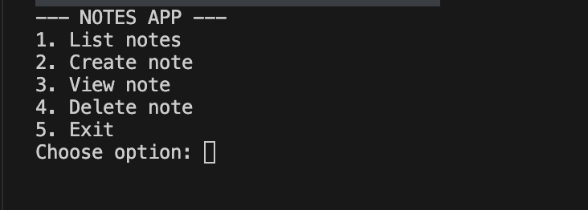
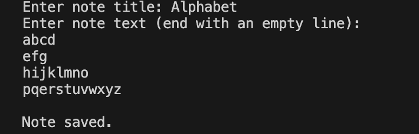
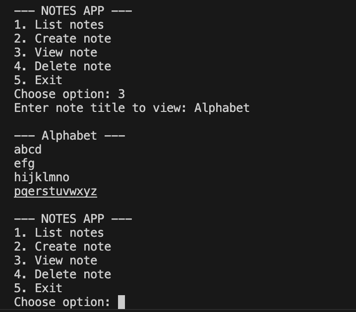

# NotesApp (Java)

A simple terminal-based notes application written in Java.  
This project allows you to create, view, list, and delete notes. Each note is saved as a `.txt` file inside a `notes/` folder.

---

## 1. What the Project Does

NotesApp is a menu-driven Java program that manages simple text notes in the terminal.  
Users can:
- List all saved notes  
- Create new notes  
- View an existing note  
- Delete a note  

All notes are stored locally in a folder called `notes/`.

---

## 2. How to Run

1. Open Terminal inside the project folder:

```
cd NotesApp
```

2. Compile the program:

```
javac NotesApp.java
```

3. Run it:

```
java NotesApp
```


---

## 3. Tools Used

- Java (any version ≥ 8)  
- Terminal / Command Line  
- Text Editor or IDE (IntelliJ, VSCode, etc.)  
- Git & GitHub for version control

---

## 4. Screenshots

  
  
  


---

## 5. What I Learned

I learned how to manage file I/O in Java and create a menu-driven program to organize data efficiently in a simple application.
